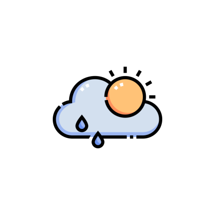
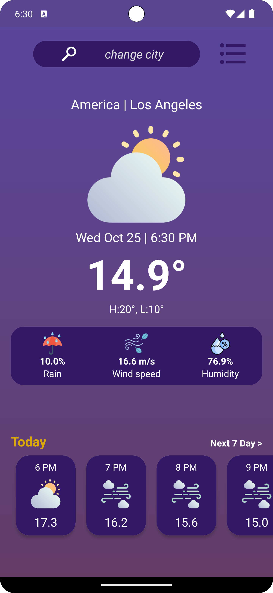

  
  <h1>Weather App</h1>

### Welcome to Weather App!

#### Weather App for Android provides accurate weather forecasts, allowing you to plan your activities with confidence. Whether you need to know the current temperature, upcoming weather, or extended forecasts, this app has you covered.

#### In this README, you'll find detailed information about the app, its features, and how to get started with weather forecasting. Stay ahead of the weather with intuitive and user-friendly Weather App!
#### Let's get started!

---
## Content
- [👨‍💻Project Overview](#Overview)
- [Technologies used](#Technologies used)
- [🌟Features](#features)
- [🛠️Installation](#installation)
- [📱Screenshots](#screenshots)
- [⚙️Usage](#usage)
- [🎯Conclusion](#conclusion)

  <h2 >👨‍💻 Project Overview</h2>

### Technologies used
___

- **AndroidX:** The project utilizes AndroidX libraries and components for modern Android development.
- **Kotlin:** The app is developed using Kotlin, a modern programming language for Android.
- **Retrofit:** Retrofit is used for making network requests and handling API responses.
- **Moshi:** Moshi is used for JSON parsing and serialization.
- **Glide:** Glide is used for image loading and caching in the app.
___
- **Room:** Room Persistence Library is used for local database storage and data access.
- **DataStore:** DataStore is used for data storage and management.
- **ViewModel:** ViewModel architecture component is used for managing UI-related data.
- **Navigation Component:** Navigation Component is used for handling navigation and UI transitions.
- **Coroutines:** Kotlin Coroutines are used for asynchronous and non-blocking programming.
___
- **Permissions:** The app uses runtime permissions to access location information for weather data.
- **RecyclerView:** RecyclerView is used for displaying dynamic lists of weather forecasts.
- **ItemTouchHelper:** ItemTouchHelper is used for swipe-to-delete functionality in location management.
- **FusedLocationProviderClient:** FusedLocationProviderClient is used for accessing device location.
___

  <h2>📱 Screenshots</h2>

  
  
  

---

  <h2 >🌟 Features</h2>

[Back to content](#content)

### 1. Current Weather:

- View current weather conditions, including temperature, humidity, and wind speed.
- Real-time updates ensure accurate information for planning activities.

### 2. Hourly Forecast:

- Get hourly weather forecasts, helping you plan your day hour by hour.
- Detailed information about temperature changes and weather conditions.

### 3. Extended Forecast:

- Access extended weather forecasts for the upcoming days.
- Plan your week effectively with insights into future weather conditions.

### 4. Location Management:

- Add multiple locations to get weather updates for different places.
- Delete and manage saved locations for personalized weather tracking.

### 5. Intuitive UI:

- User-friendly interface for effortless navigation and quick weather updates.
- Clear visuals and easy-to-understand weather information.

### 6. Location Permissions:

- Request location permissions to provide accurate weather data based on your current location.
- Grant permission for location-based weather updates and forecasts.

### 7. Search Functionality:

- Search for specific locations to get detailed weather information.
- Enter city names or regions to access weather forecasts for any location.

### 8. Image Loading:

- Efficient image loading for weather icons and visuals.
- Smooth loading and caching of weather icons using Glide and Coil libraries.
___

  <h2 >⚙️ Usage</h2>

[Back to content](#content)

#### You can install and use this application directly on your Android device. Follow the steps below to get started:

1. **Download the App:**
    - Download the APK file of the Weather App from the provided link.
    - Allow installation from unknown sources in your device's settings.
    - Install the app on your Android device.

2. **Launch the App:**
    - Open the Weather App on your Android device.
    - Grant location permissions for accurate weather updates.
    - Explore the intuitive user interface and various features.

3. **View Current Weather:**
    - Upon launch, the app displays the current weather conditions of your location.
    - Check temperature, humidity, wind speed, and weather icons for real-time weather updates.

4. **Hourly and Extended Forecast:**
    - Navigate to the hourly forecast section to view hourly weather predictions for the day.
    - Access the extended forecast to plan your week with detailed

### 🎯 Conclusion

Thank you for using Weather App!

I hope this app provides you with accurate weather information to plan your day effectively. If you have any feedback or suggestions, feel free to reach out. Enjoy exploring the weather with Weather App!

  <h2>Happy Forecasting! ☀️☔️</h2>

---
